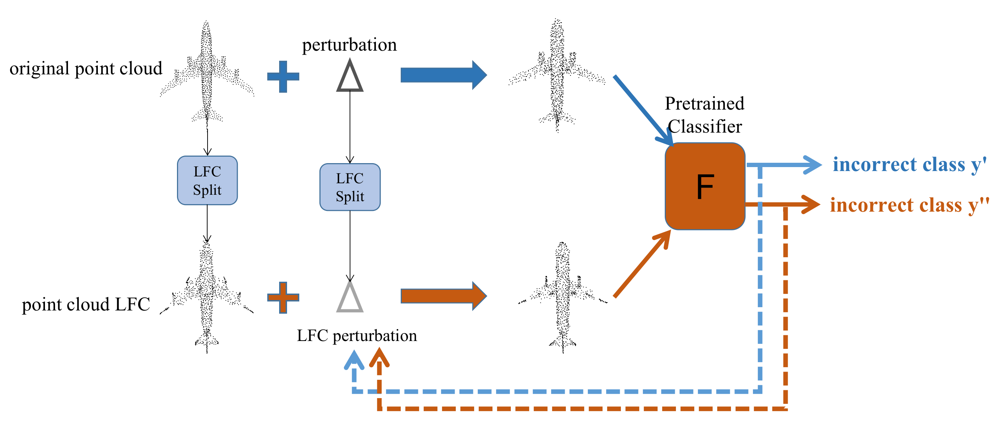

## AOF Attack

This repository is the official PyTorch implementation of [Boosting 3D Adversarial Attacks with Attacking On Frequency](https://arxiv.org/pdf/2201.10937)



### Introduction
Deep neural networks (DNNs) have been shown to be vulnerable to adversarial attacks in the image domain. Recently, 3D adversarial attacks, especially adversarial attacks on point clouds, have elicited mounting interest. However, adversarial point clouds obtained by previous methods show weak transferability and are easy to defend. To address these problems, in this paper we propose a strong point cloud attack method named AOF which pays more attention to the low-frequency component of point clouds. We combine the losses from point cloud and its low-frequency component to craft adversarial samples and focus on the low-frequency component of point cloud in the process of optimization. Extensive experiments validate that AOF can improve the transferability significantly compared to state-of-the-art (SOTA) attacks, and is more robust to state-of-the-art 3D defense methods. Otherwise, compared to adversarial point clouds generated by other adversarial attack methods, adversarial point clouds obtained by AOF contain more deformation than outlier.


If you find our code or paper useful, please considering citing

```
@article{liu2022boosting,
  title={Boosting 3D Adversarial Attacks with Attacking On Frequency},
  author={Liu, Binbin and Zhang, Jinlai and Chen, Lyujie and Zhu, Jihong},
  journal={arXiv preprint arXiv:2201.10937},
  year={2022}
}
```

### How to use

#### Dataset
we use aligned modelnet40 dataset to test the untargeted attack: https://shapenet.cs.stanford.edu/media/modelnet40_normal_resampled.zip download and unzip as baselines/official_data/modelnet40_normal_resampled
 our pretrained model weights for aligned modelnet40 dataset:
 without data augmentation:https://drive.google.com/file/d/1UP0Io60MSZjq2VqaJpLeJiyD6zeELJtz/view?usp=sharing

 with data augmentation:https://drive.google.com/file/d/1AEWorvStis4GkfOfk2psKDiDK2xcOsLR/view?usp=sharing

 we use data and pretrained models of IF-Defense for targeted attack.

#### Attack
cd baselines

untargeted aof attack:

NCCL_DEBUG=INFO CUDA_VISIBLE_DEVICES=0,1,2,3,4 python -m torch.distributed.launch --nproc_per_node=5 --master_port=29502 attack_scripts/untargeted_aof_attack.py --process_data --model=pointnet --batch_size=128


untargeted advpc attack:

NCCL_DEBUG=INFO CUDA_VISIBLE_DEVICES=0,1,2,3,4 python -m torch.distributed.launch --nproc_per_node=5 --master_port=29502 attack_scripts/untargeted_advpc_attack.py --process_data --model=pointnet --batch_size=32


#### Evaluate
merge and inference generated adversarial examples:

CUDA_VISIBLE_DEVICES=0 python inference.py --data_root=attack/results/mn40_1024/AdvPC --prefix=UAdvPC-pointnet-0.18-GAMMA_0.25 --model=pointconv


### License
Our code is released under MIT License.